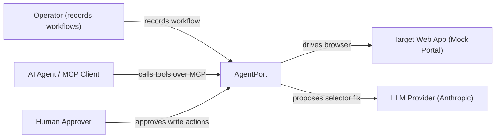
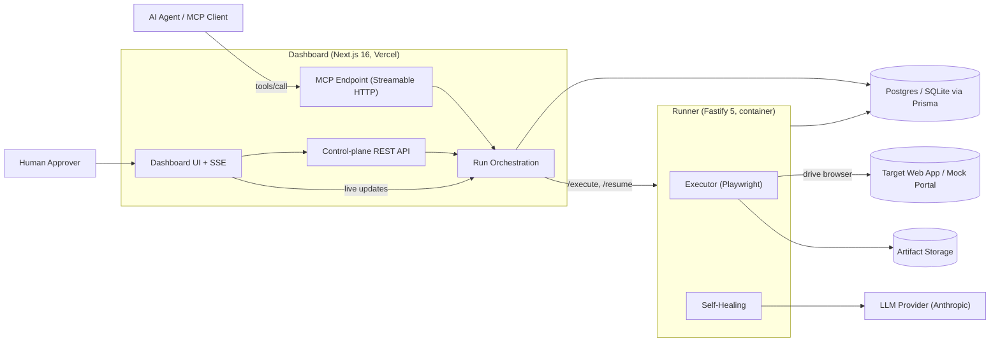
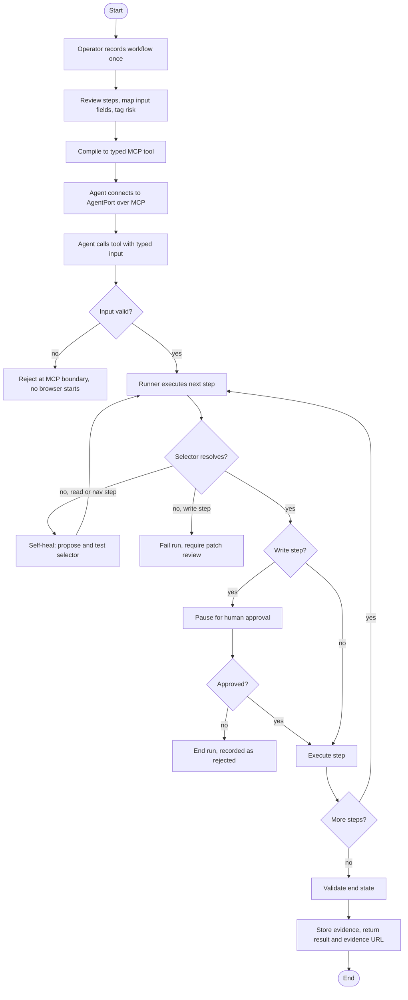
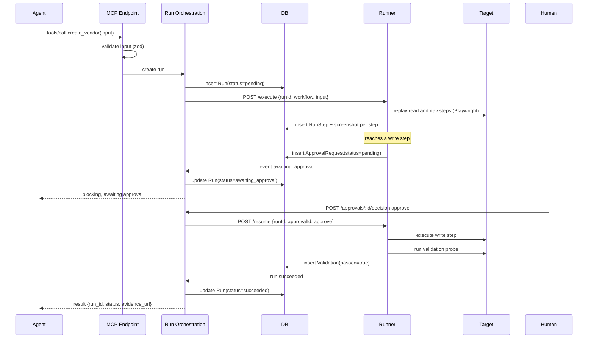
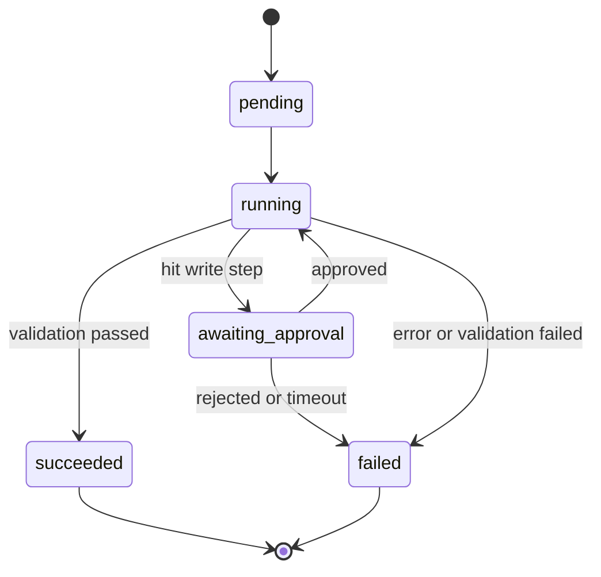
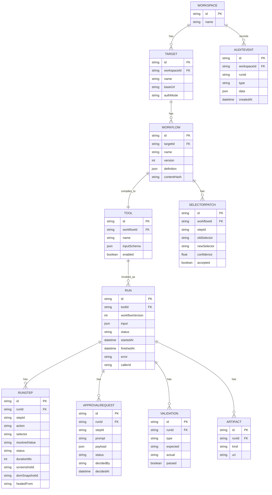
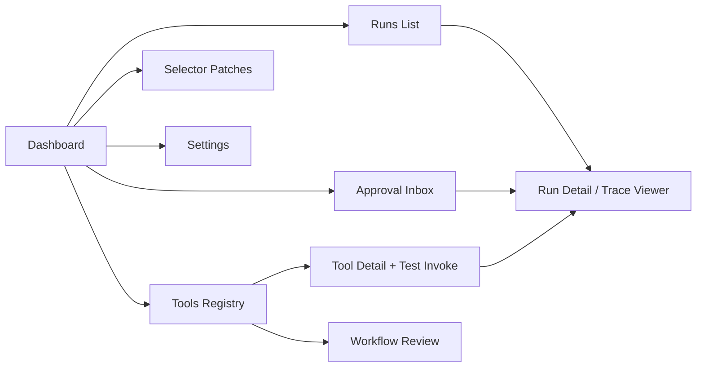
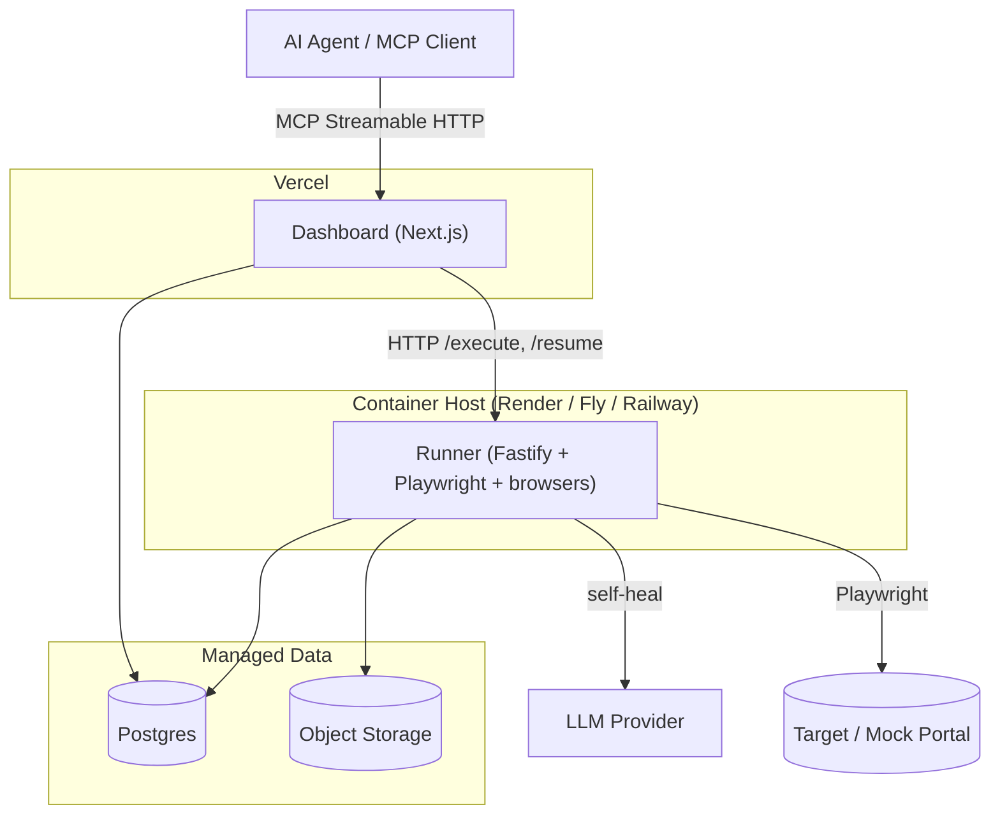

# AgentPort Technical Design

Status: draft for build. This document is self-contained. It carries everything
needed to build AgentPort technically: the architecture, user flows, diagrams,
data model, API contracts, security model, testing, observability, deployment,
build order, and the first vertical slice. You do not need any other document to
start building.

Library versions were verified against current docs on 2026-06-27: Next.js 16,
MCP TypeScript SDK 1.29 (v2 in alpha), Fastify 5, Playwright 1.61, Prisma 6.19
(7.x released), zod 4, Vercel AI SDK 5 (v6 beta), Vitest 3.

## 1. Overview

AgentPort records a human web-app workflow once and turns it into a typed,
audited tool that AI agents can call over the Model Context Protocol (MCP). The
agent supplies intent and parameters. AgentPort executes the workflow
deterministically in a real browser, pauses for human approval on risky actions,
validates the result, and stores replayable evidence. When a target UI changes
and a selector breaks, AgentPort proposes and tests a replacement so the tool
keeps working.

The reference workflow used throughout this document is vendor onboarding:
create a vendor in a procurement portal and submit it for approval.

## 2. Goals and non-goals

### Goals

- Compile a recorded workflow into a typed MCP tool.
- Execute the workflow deterministically. The model never drives clicks.
- Gate write actions behind human approval.
- Validate the end state and store full evidence per run.
- Recover from a broken selector by proposing and testing a replacement.

### Non-goals (this phase)

- Generic any-website automation. AgentPort runs specific recorded workflows.
- Letting the model click freely.
- Real third-party systems (SAP, Ariba). The target is a controlled mock portal.
- Multi-tenant RBAC, SSO, billing, and a durable distributed queue. These are
  production concerns, scoped out of the first build and listed later as
  extensions.

## 3. Design principles

1. The LLM is confined to two places: mapping user intent to typed tool inputs
   (on the agent side, before the call) and proposing a replacement selector on
   failure (a strict, tested JSON patch). Everything else is deterministic.
2. Workflow JSON is the contract between recorder, compiler, and runner.
3. Pure domain logic (the compiler and validators) lives in a package with no
   I/O so it stays unit-testable.
4. The runner owns the browser and holds no product logic beyond execution.
5. Validate at every boundary with zod: REST bodies, MCP inputs, runner
   messages, and LLM responses.
6. Write actions are special: they require approval, never auto-retry, and never
   auto-heal without human sign-off.
7. The audit log is append-only and treated as evidence.

## 4. Technology stack

| Concern | Choice | Version | Notes |
|---|---|---|---|
| Language | TypeScript | 5.x | One language across all apps and packages. |
| Monorepo | pnpm workspaces, Turborepo | pnpm 9, turbo 2 | Caching and task running. |
| Dashboard, REST, MCP endpoint | Next.js (App Router) | 16.x | Browser-free. Deploys on Vercel. |
| MCP server | @modelcontextprotocol/sdk | 1.29 | Streamable HTTP transport. SSE is deprecated; do not use it. |
| Runner service | Fastify | 5.x | Owns Playwright. Deploys as a container. |
| Browser automation and e2e | Playwright + Playwright Test | 1.61 | Execution engine and end-to-end tests. |
| ORM | Prisma | 6.19 | Postgres in production, SQLite locally. Pin 6.x; 7.x is a later upgrade. |
| Validation | zod | 4.x | Boundary validation and input schemas. |
| Self-healing LLM | Vercel AI SDK + @ai-sdk/anthropic | AI SDK 5 | Structured output with a zod schema. |
| Unit tests | Vitest | 3.x | Compiler, validators, boundary schemas. |
| UI | Tailwind CSS + shadcn/ui | Tailwind 4 | Components owned in-repo. |
| Dashboard hosting | Vercel | n/a | First-party Next.js host. |
| Runner hosting | Render / Fly.io / Railway | n/a | Long-lived container with browser binaries. |

The two highest-churn dependencies are the MCP SDK (v2 in alpha, package rename
incoming) and Prisma (7.x just shipped with a config migration). Stay on their
stable lines and pin minor versions.

## 5. System context



AgentPort sits between agents and a target web app. Operators teach it
workflows, agents call them, humans approve risky steps, and an LLM is used only
to repair broken selectors.

## 6. High-level architecture

Two deployables plus shared packages, all TypeScript in a pnpm monorepo.

```
apps/
  dashboard/    Next.js 16: UI + control-plane REST API + MCP HTTP endpoint
  runner/       Fastify 5: owns Playwright, executes workflows
  mock-portal/  Next.js: the demo procurement portal (the target app)
packages/
  core/         Workflow types, tool compiler, validators, zod schemas (no I/O)
  db/           Prisma schema + generated client
```



The dashboard is browser-free and hosts the human UI, the REST control plane,
and the MCP endpoint. The runner is the only component that touches a browser.
This split exists because Playwright needs a long-lived container with browser
binaries and real memory, which does not run on Vercel serverless functions.
Keeping all browser work behind the runner's HTTP contract lets the dashboard
deploy on Vercel.

## 7. User flows

Three flows define the product: recording a workflow, an agent running a tool
with approval, and self-healing a broken selector.



### 7.1 Operator records a workflow

1. The operator captures the workflow against the target. For the first build,
   start from Playwright `codegen` output and hand-edit it into Workflow JSON. A
   polished record UI is a later extension.
2. In the dashboard, the operator reviews the steps, maps which fields are tool
   inputs, and tags risky steps as `write`.
3. The operator compiles the workflow into an MCP tool with a typed input schema.

### 7.2 Agent runs a tool with approval

1. The agent connects to the MCP endpoint and lists tools.
2. The agent calls a tool (for example `create_vendor`) with typed input derived
   from a user request.
3. The runner replays the workflow deterministically. Read and navigation steps
   run straight through.
4. At the write step, the run pauses. The approval inbox shows the action and the
   resolved inputs.
5. A human approves. The runner executes the write step, then validates the end
   state. The agent receives a structured result with an evidence URL.

### 7.3 Self-healing a broken selector

1. A selector resolves to zero elements because the UI changed.
2. If the step is a write step, the run fails and requires a human-reviewed
   patch. Write steps never auto-heal.
3. If the step is read or navigation, the runner captures the page accessibility
   tree, asks the LLM for a replacement selector in a fixed schema, tests the
   proposal against the live page, and continues if exactly one element matches
   with sufficient confidence. The proposed change is saved as a patch for
   review.

## 8. Key sequences

### 8.1 Tool call with approval gate



For the first build the MCP call blocks until the human decides, with a timeout.
The async fallback is to return `run_id` immediately and expose a
`get_run_status` tool the agent can poll.

### 8.2 Self-healing

```mermaid
sequenceDiagram
    participant Runner
    participant Target
    participant LLM
    participant DB

    Runner->>Target: resolve selector for step
    Target-->>Runner: 0 matches
    alt write step
        Runner->>DB: fail run, require human patch review
    else read or nav step
        Runner->>Target: capture accessibility tree
        Runner->>LLM: propose replacement (fixed schema)
        LLM-->>Runner: {selector, confidence}
        Runner->>Target: test proposed selector
        alt exactly 1 match and confidence ok
            Runner->>DB: SelectorPatch(accepted=false); continue run
        else
            Runner->>DB: fail run with reason
        end
    end
```

The LLM receives the accessibility tree as data, never as instructions, and must
answer in the fixed `{ selector, confidence }` schema. The proposal is tested
against the live page before it is used. This is the primary mitigation for
prompt injection from target page content.

## 9. Run lifecycle



A run is the unit of execution. It is never silently retried as a whole. Only
read and navigation steps may retry. A run in `awaiting_approval` holds an open
ApprovalRequest and a suspended browser context; both must be cleaned up on
approval, rejection, or timeout.

## 10. Modules

### packages/core (pure, no I/O, fully unit-tested)

- **Workflow schema and types.** zod schemas for Workflow JSON. Parsing and
  validation helpers.
- **Tool compiler.** `compileTool(workflow) -> ToolDefinition`. Maps
  `workflow.inputs` to a JSON Schema, validates that every step `field`
  reference exists in `inputs`, and produces a stable tool name plus a content
  hash of the workflow version.
- **Input resolver.** Binds tool-call inputs to workflow steps, producing the
  concrete value each step will use.
- **Validators.** Given a validation spec and a page probe result, decide pass or
  fail and produce the expected-versus-actual record.

### packages/db

- Prisma schema and generated client. The only path to the database. No business
  logic.

### apps/dashboard (Next.js 16)

- **Control-plane REST API** via route handlers: workflows, tools, runs,
  approvals, artifacts, patches.
- **MCP endpoint** at `/mcp`: an MCP server using `@modelcontextprotocol/sdk`
  over the Web-standard Streamable HTTP transport, registering one MCP tool per
  enabled `Tool` row.
- **Dashboard UI**: the screens in section 14.
- **Run orchestration**: creates runs, calls the runner, records results, and
  emits SSE updates.

### apps/runner (Fastify 5)

- **Executor**: drives Playwright step by step from a Workflow and resolved
  inputs. Captures a screenshot and DOM snapshot per step. Emits step events.
- **Approval pause/resume**: on a write step, requests approval and suspends the
  browser context until `/resume` arrives.
- **Self-healing**: on a zero-match selector, captures the accessibility tree and
  calls the LLM for a replacement, tests it, and continues or fails.
- **Artifact writer**: persists screenshots, DOM snapshots, and traces.

### apps/mock-portal (Next.js)

- A small app with a vendor form and a success state. The controllable target for
  development and the demo, including the scripted label change used to show
  self-healing.

## 11. Workflow JSON contract

The contract at the center of the system. An ordered list of browser actions;
input-bound fields carry a `field` reference instead of a literal value.

```json
{
  "name": "create_vendor",
  "version": 3,
  "target": "mock-procurement",
  "startUrl": "/vendors/new",
  "inputs": {
    "company_name": { "type": "string", "required": true },
    "country": { "type": "string", "required": true },
    "tax_id": { "type": "string", "required": true },
    "risk_level": { "type": "enum", "values": ["low", "medium", "high"] }
  },
  "steps": [
    { "id": "s1", "action": "click", "selector": "button:has-text('Create Vendor')" },
    { "id": "s2", "action": "fill", "selector": "input[name='companyName']", "field": "company_name" },
    { "id": "s3", "action": "fill", "selector": "input[name='taxId']", "field": "tax_id" },
    { "id": "s4", "action": "select", "selector": "select[name='country']", "field": "country" },
    { "id": "s5", "action": "click", "selector": "button:has-text('Submit')", "risk": "write" }
  ],
  "validation": { "type": "element_visible", "selector": "text=Vendor created", "expects": "company_name" }
}
```

Actions for the first build: `goto`, `click`, `fill`, `select`, `waitFor`. Risk:
unset (read or navigation) or `write` (approval gate). Retries are allowed on
read and navigation steps only, never on write steps.

## 12. Data model

Postgres via Prisma 6.19; SQLite for local development.



Notes:

- `Run.status` is one of `pending`, `running`, `awaiting_approval`, `succeeded`,
  `failed`.
- `Artifact.kind` is one of `screenshot`, `dom`, `trace`.
- `AuditEvent` is append-only. Never update or delete a row.
- `Run.workflowVersion` records exactly which workflow version executed, so every
  action is attributable.

## 13. API contract

### 13.1 Control-plane REST (dashboard)

| Method | Path | Purpose |
|---|---|---|
| POST | `/api/workflows` | Create a workflow from a recording or hand-authored JSON |
| GET | `/api/workflows/:id` | Workflow and its versions |
| POST | `/api/workflows/:id/compile` | Compile into a Tool |
| GET | `/api/tools` | List tools |
| GET | `/api/tools/:id` | Tool detail, schema, MCP connection snippet |
| POST | `/api/tools/:id/runs` | Invoke a tool (same path the MCP call uses internally) |
| GET | `/api/runs` | List runs with status filters |
| GET | `/api/runs/:id` | Run detail: steps, approvals, validation |
| GET | `/api/runs/:id/stream` | Server-sent events for live run updates |
| GET | `/api/approvals` | Pending approval requests |
| POST | `/api/approvals/:id/decision` | Body `{ "decision": "approve" \| "reject" }` |
| GET | `/api/runs/:id/artifacts` | Screenshots, DOM snapshots, trace |
| GET | `/api/patches` | Proposed selector patches |
| POST | `/api/patches/:id/accept` | Accept a patch into the workflow |

All bodies are validated with zod. Errors return `{ error: { code, message } }`,
never a bare 500 with a stack.

### 13.2 MCP endpoint (dashboard)

Built with `@modelcontextprotocol/sdk` over Streamable HTTP. One MCP tool per
enabled `Tool`, registered as:

```
server.registerTool(name, { description, inputSchema }, handler)
```

where `inputSchema` is a zod object derived from the compiled tool. A tool call:

1. Validates input against the tool schema.
2. Creates a Run.
3. Calls the runner and waits.
4. If the run hits an approval gate, it stays `awaiting_approval`; the dashboard
   surfaces it. The call blocks until the human decides, with a timeout. Async
   fallback: return `run_id` immediately plus a `get_run_status` tool.
5. Returns a structured result:

```json
{ "run_id": "run_123", "status": "succeeded", "validation": { "passed": true }, "evidence_url": "https://.../runs/run_123" }
```

SSE transport is not used. It is deprecated and will not be served in SDK v2.

### 13.3 Runner contract (internal, dashboard to runner)

| Method | Path | Purpose |
|---|---|---|
| POST | `/execute` | Body `{ runId, workflow, input }`. Streams step events back |
| POST | `/resume` | Body `{ runId, approvalId, decision }`. Continues a paused run |
| GET | `/health` | Liveness |

The runner authenticates requests with a shared secret and holds no product
logic beyond execution.

## 14. Frontend flows

Next.js 16 App Router, Tailwind 4, shadcn/ui. Screens ordered by demo value.



1. **Approval inbox** — live pending approvals over SSE. Each card shows the
   action and resolved inputs with Approve and Reject. The demo centerpiece.
2. **Run detail / trace viewer** — step timeline with screenshots, inputs,
   approval record, validation, healing events, and failure reason.
3. **Runs list** — recent runs with status and duration.
4. **Tools registry** — tools, schemas, an MCP connection snippet, and a
   built-in Test Invoke button that calls the tool through the same path an agent
   would.
5. **Workflow review** — recorded steps, field-to-input mapping, risk tags.
6. **Selector patches** — proposed heals awaiting acceptance.
7. **Settings** — MCP endpoint URL and workspace token.

Data flow: Server Components read through `packages/db`. Mutations go through REST
route handlers. Live run state arrives over SSE from `/api/runs/:id/stream`.

## 15. Background jobs and execution model

- **First build:** execution is synchronous behind the runner's HTTP contract.
  The dashboard calls `/execute` and holds the request open, streaming step
  events and persisting them. Approval pauses the run; the runner holds the
  browser context until `/resume`. Runs are serialized per tool.
- **Production extension:** a durable queue (a jobs table or a managed queue) so
  runs survive process restarts, with bounded concurrency, per-tool rate limits,
  a retry policy for read and navigation steps only, and an approval-timeout
  sweeper that closes stale `awaiting_approval` runs. Artifact cleanup and trace
  retention run as scheduled jobs.

The approval gate is the one long-lived state and is modeled explicitly in the
run lifecycle (section 9).

## 16. External services

- **MCP clients** (Claude, Cursor, Codex, or the built-in Test Invoke): connect
  to the dashboard `/mcp` endpoint over Streamable HTTP.
- **LLM provider** (Anthropic via `@ai-sdk/anthropic`, OpenAI swappable): one
  call site, the self-healing selector proposal. Uses the AI SDK with
  `generateText` and `Output.object({ schema })` for typed output. The older
  `generateObject` still works on AI SDK 5, but `Output.object` is the
  forward-compatible form.
- **Database**: Postgres in production (Neon, Supabase, or RDS); SQLite locally.
- **Artifact storage**: local filesystem in dev; object storage (S3 or Vercel
  Blob) in production for screenshots, DOM snapshots, and traces.
- **Target web app**: the mock portal for the first build; real internal apps
  later.

## 17. Security

AgentPort acts inside business systems, so security is first-class.

- **Least privilege.** A tool exposes one workflow, not general browser access.
  Agents can only call compiled, enabled tools.
- **Approval for write actions.** Every `write` step pauses for human approval.
  No write executes without a recorded decision.
- **Untrusted page content.** Page text and DOM are data, never instructions. The
  self-healing model receives the accessibility tree as data and must answer in a
  fixed `{ selector, confidence }` schema; its output is tested against the live
  page before use.
- **Boundary validation.** zod validates every external input: REST bodies, MCP
  tool inputs, runner messages, and LLM responses. Invalid tool input is rejected
  before any browser session starts.
- **Secrets.** Real values only in env, which is gitignored. Commit
  `.env.example`. Validate required env at startup with zod and fail fast. Never
  log secret values. Target credentials, when added in production, live in a
  vault, not in workflow definitions.
- **Service auth.** Dashboard-to-runner calls use a shared secret. The MCP
  endpoint requires a workspace token. Production adds per-workspace auth, RBAC,
  and SSO.
- **Audit integrity.** AuditEvent is append-only. Runs record the exact workflow
  version and inputs so actions are attributable and replayable.
- **No detection evasion.** AgentPort automates a company's own tools with
  authorization. It does not bypass anti-automation controls or solve captchas.

## 18. Configuration and environment variables

Real values live only in `.env`, which is gitignored. Commit `.env.example` with
placeholder keys. Validate required variables at startup with zod and fail fast.
Only `NEXT_PUBLIC_*` variables reach the browser; never put secrets there.

| Variable | Service | Purpose |
|---|---|---|
| `DATABASE_URL` | dashboard, runner | Postgres connection string, or SQLite path locally |
| `RUNNER_URL` | dashboard | Base URL of the runner service |
| `RUNNER_SHARED_SECRET` | dashboard, runner | Authenticates dashboard-to-runner calls |
| `RUNNER_PORT` | runner | Port the runner listens on |
| `MCP_WORKSPACE_TOKEN` | dashboard | Token agents present to the MCP endpoint |
| `ANTHROPIC_API_KEY` | runner | Self-healing LLM calls |
| `AI_MODEL` | runner | Model id used for self-healing |
| `ARTIFACT_STORAGE` | runner | `local`, `s3`, or `blob` |
| `ARTIFACT_DIR` | runner | Local artifact directory when storage is `local` |
| `MOCK_PORTAL_URL` | runner | Base URL of the target app |
| `NEXT_PUBLIC_APP_URL` | dashboard | Public dashboard URL used in evidence links |
| `NODE_ENV` | all | `development`, `test`, or `production` |
| `LOG_LEVEL` | all | Logging verbosity |

## 19. Testing

- **Unit (Vitest 3):** the compiler and validators in `packages/core`, including
  field-mapping validation and expected-versus-actual logic. Pure and must be
  covered.
- **Boundary (Vitest):** zod parsing for REST, MCP input, runner messages, and
  the LLM response shape, including rejection of bad input.
- **Runner handler tests (Fastify `app.inject`):** `/execute` and `/resume`
  behavior with a stubbed Playwright layer, including the approval pause and the
  heal path.
- **End-to-end (Playwright Test 1.61):** the vertical slice against the mock
  portal (invoke `create_vendor`, fill and submit, reach success, assert the Run
  is `succeeded` with a screenshot per step) and a second test for the scripted
  selector change and successful heal.
- **CI:** type-check, lint, unit, and e2e on every pull request. Do not merge on
  red. Run the narrowest relevant check first, then broaden.

## 20. Observability

- **Structured logging** keyed by `runId` across the dashboard and the runner, so
  a run is traceable end to end.
- **Run timeline** in the dashboard is the primary operational view: per-step
  status, duration, screenshots, approval, validation, and healing events.
- **Metrics (production):** run success rate per tool, self-heal frequency and
  success rate, median run latency excluding approval wait, approval response
  time, and tool-call volume.
- **Tracing (production):** OpenTelemetry spans across the MCP call, run
  orchestration, runner execution, and the LLM heal call. Agent execution is
  non-deterministic, so structured traces are how failures get debugged.
- **Alerting (production):** on rising failure rates and rising heal frequency,
  which signals target UI drift.

## 21. Deployment



- **Dashboard:** Vercel. Browser-free. Hosts REST and the MCP endpoint.
  Environment variables managed in Vercel and pulled locally with the CLI.
- **Runner:** a container on Render, Fly.io, or Railway with Playwright browser
  binaries installed and sized for browser memory. Run locally for the demo. This
  is the only component with a hard hosting constraint.
- **Database:** managed Postgres in production; a SQLite file locally.
- **Artifacts:** object storage in production; local filesystem in dev.
- **Config:** every service validates required env at startup. Pin minor
  versions; upgrade the MCP SDK and Prisma deliberately off their stable lines.

## 22. Build milestones

Ordered so each milestone ends in something demoable. Keep the codebase clean
from the first commit.

- **M0 — Scaffold.** pnpm workspace, the three apps and two packages, Prisma
  schema, TypeScript strict, ESLint, Prettier, Vitest, CI on pull requests,
  `.env.example`.
- **M1 — Mock portal.** The vendor form and a "Vendor created" success state.
  The target the executor needs, so it comes first.
- **M2 — Deterministic executor.** The runner replays a hand-authored
  `create_vendor` workflow against the portal and captures a screenshot per step.
  Persists a Run and RunSteps. This is the first vertical slice (section 23).
- **M3 — Compiler and MCP.** Compile the workflow into a Tool, expose it over the
  MCP endpoint, invoke it from the built-in Test Invoke button.
- **M4 — Approval gate and inbox.** Pause on the write step, surface it in the
  approval inbox, resume on decision, stream updates over SSE.
- **M5 — Validation.** Post-run check that the vendor exists; record pass or fail.
- **M6 — Trace viewer.** The full run detail page with screenshots and records.
- **M7 — Self-healing.** Break the submit selector, propose and test a patch,
  recover, save the patch. The headline moment.
- **M8 (stretch) — Recorder UI.** Replace hand-authored JSON with a record mode.

## 23. First vertical slice

The thinnest end-to-end path that proves the core idea and is demoable. This is
milestone M2 and depends only on M0 and M1.

**Goal:** invoke `create_vendor` and watch a real browser complete the vendor
form on the mock portal, with the run and its evidence persisted and viewable.

**In the slice:**

- Mock portal with a working vendor form and a success page.
- A hand-authored `create_vendor` workflow JSON (section 11).
- The runner executes the workflow deterministically with Playwright.
- A Run and RunSteps are persisted, with one screenshot per step stored as
  artifacts.
- A minimal run detail page renders the steps and screenshots in order.
- Triggered from `POST /api/tools/:id/runs` or a small script. Full MCP wiring
  comes in M3.

**Not in the slice:** approval gate, validation, self-healing, the MCP endpoint,
and the recorder. Each is its own next increment (M3 through M7).

**Acceptance criteria:**

- Calling the run endpoint with valid input fills and submits the form and
  reaches the success page.
- The Run ends in `succeeded`, with one RunStep per workflow step and a stored
  screenshot for each.
- The run detail page shows the steps and screenshots in execution order.
- Compiler unit tests and one Playwright e2e test for this path pass in CI.
- Invalid input (missing `company_name`) is rejected at the boundary with a typed
  error, and no browser session starts.

## 24. Risks

| Risk | Impact | Mitigation or fallback |
|---|---|---|
| Self-healing unreliable on demo day | Headline feature fails live | Scope the heal to the known "Submit" to "Send for Approval" change; keep a manual patch-accept path |
| Playwright on serverless | Runner will not run on Vercel | Runner is a separate container; never put browser work in the dashboard |
| Prisma 7 churn | Breaking config migration mid-build | Pin Prisma 6.19; treat 7.x as a planned upgrade |
| MCP SDK v2 alpha | API shift, package rename | Stay on stable v1.x; build on Streamable HTTP, not SSE |
| AI SDK API drift | generateObject deprecation path | Use `generateText` + `Output.object`; isolate the call in one module |
| Approval blocking hangs the agent | MCP call times out | Async path: return `run_id` plus a `get_run_status` tool |
| Playwright timing flakiness | Intermittent run failures | Explicit waits, seeded mock portal, retries on read and nav steps only |
| Prompt injection from page content | Model manipulated by target page | Page content is data; heal model answers in a fixed schema, output tested before use |
| LLM cost and latency | Slow or expensive runs | Call the model only on selector failure; cache accepted patches |
| Scope creep into many targets | Nothing ships | One target, one workflow; production scope is deferred |
| MCP client integration friction | Cannot demo a live agent call | Built-in Test Invoke calls the tool through the same path |

## 25. Open questions

- Final hosting target for the runner (Render vs Fly vs Railway) once cold start
  and browser memory are measured.
- Whether to adopt a managed queue at the production stage or start with a jobs
  table.
- Approval routing model for production (thresholds, roles, escalation).
- Whether to revisit Drizzle versus Prisma if dashboard cold starts become a
  concern.